# governor

[](https://github.com/billdmar/governor/actions/workflows/ci.yml)
[](https://github.com/billdmar/governor/actions/workflows/renode.yml)
[](docs/DEMO.md)
[](fuzz/)
[](LICENSE)
[](https://www.zephyrproject.org/)
[](docs/RULES.md)

> Production-style **Zephyr RTOS** firmware for a telemetry-and-control node,
> verified like safety-critical software: a **16-scenario fault-injection
> matrix** on emulated hardware with required safe-state outcomes, **178.8 M
> executions of libFuzzer+ASan** on the link protocol with zero findings,
> property-tested invariants, static-analysis discipline, and **CI on simulated
> hardware** (QEMU + Renode STM32).

HAL-abstracted sensor drivers, a PID control loop on a simulated plant, a
CRC-framed reliable UART link (ack / retransmit / dedup), health + hardware
watchdog, and an explicit `INIT → RUN → DEGRADED → SAFE_STOP` safety state
machine — built as **host-portable C** (protocol, control, telemetry, safety,
config) that is unit-tested, property-tested, and fuzzed on the host *before*
any firmware integration, then wired to Zephyr through thin adapters.

### It runs, and it fails safe

[](docs/DEMO.md)

*Stitched from two real, labeled sources: the **boot → RUN → track** lines are
QEMU Cortex-M3 console output ([`docs/DEMO.md`](docs/DEMO.md) §1); the **operator
e-stop → `SAFE_STOP`** step is the Renode STM32 F13 scenario
(`renode/system_faults.robot`), which writes the 9-byte CMD frame to the link UART
and asserts `state=SAFE_STOP` (the full `faults=0x200` status line is the node's
real console format). Virtual time — logic/structure, not silicon. (Static
[PNG](docs/img/demo.png) if the animation doesn't play.)*

## What this demonstrates (systems-engineering signal, any domain)

Firmware is the vehicle; the transferable engineering is general. This repo is a
worked example of building a reliable system and *proving* it:

- **Reliable transport over an unreliable channel** — a framed protocol with
  CRC integrity, sequencing, stop-and-wait acknowledgement/retransmit, and
  idempotent de-duplication (the same problems as an RPC or streaming layer),
  specified in `docs/PROTOCOL_SPEC.md` and fuzzed to 178 M executions.
- **Explicit state machines over implicit state** — a single authoritative
  safety state machine (`INIT/RUN/DEGRADED/SAFE_STOP/FAULT_HALT`) where every
  transition and failure mode is enumerated, table-tested, and can't deadlock or
  silently degrade.
- **Fault tolerance as a first-class deliverable** — a 16-scenario fault matrix
  with *required outcomes* and deterministic replays; failures are injected,
  not hoped against.
- **Testing rigor** — unit + **property-based** tests (invariants over
  exhaustive inputs, e.g. torn-write safety swept at every byte offset),
  **coverage-guided fuzzing** with sanitizers, and **98 % line coverage**.
- **CI/CD on hard-to-test targets** — GitHub Actions runs the suite on *simulated
  hardware* (QEMU + a Renode STM32 machine) on every push; I debugged and fixed
  the emulator itself (a missing STM32 clock model) to get there.
- **Memory & resource discipline** — zero dynamic allocation after init, bounded
  static buffers, measured per-task stack high-water marks — the habits that
  matter for any performance- or reliability-critical service.
- **Engineering judgment & honesty** — every emulated number is labeled as
  virtual-time; where a tool can't faithfully model something, that limit is
  documented rather than papered over (see [honest emulation limits](#honest-emulation-limits)).

New to embedded? Start with [`docs/DEMO.md`](docs/DEMO.md) (real transcripts) and
the [architecture](#architecture) diagram; the concepts map directly to
distributed-systems and backend reliability work.

## Headline results (all freshly measured; emulation / virtual-time labeled)

| Pillar | Result |
|---|---|
| **Fault-injection matrix** | **16 / 16** scenarios (F01–F16) meet their required safe-state outcome, with deterministic replay |
| **Renode STM32 scenarios** | **8 / 8** pass in CI on a real STM32F103 machine (boot, link, watchdog, reset-recovery) |
| **Protocol fuzzing** | **178,832,918** executions, libFuzzer + ASan + UBSan, **zero** crashes / leaks / overreads; 1123-file corpus committed |
| **Tests** | **2298** host C assertions + **43** Python; property tests for framing, dedup, torn-write, safety transitions |
| **Coverage** | **98.16 %** line coverage on host-portable modules (proto 98.5 · control 100 · telem 99.0 · safety 96.1 · config 98.8) |
| **Control-loop timing** † | **100.00 %** period adherence (10.000 ms mean, ±0 jitter), **0** missed deadlines over a multi-second capture (tens of thousands of control periods) |
| **Stack margins** † | every task **≥ 63 %** unused vs a required ≥ 25 % (control 79 · link_rx 82 · link_tx 88 · telemetry 63 · health 83) |
| **Memory discipline** | **0** dynamic allocations after init; `-Wall -Wextra -Werror -Wconversion` clean; clang-tidy + cppcheck clean; **0** Zephyr includes in `lib/` |
| **Footprint** | STM32F103: **48.9 KB** flash / **13.0 KB** RAM · qemu_cortex_m3: 29.6 KB / 12.4 KB |

† **Timing and stack figures are measured in virtual time under QEMU/Renode.**
They validate *logic and timing structure* (period adherence, deadline
behavior, fault-response ordering, stack high-water) — they are **not** silicon
performance numbers. See [Honest emulation limits](#honest-emulation-limits).

## Architecture


<details><summary>Text version (accessible / searchable)</summary>

```
                    ┌─────────────────────── governor node (Zephyr) ───────────────────────┐
   emulated I2C     │                                                                       │
   sensor  ─────────┼─▶ drivers/  ──sample──▶ [control p4,100Hz] ──PID──▶ safety clamp ──▶ plant
   (0x48)           │   (HAL vtable)               │                         │              │
                    │                              ▼                         ▼              │
                    │                       [health p8,20Hz] ──feeds──▶ hardware watchdog    │
                    │                              │  (only if system scheduling is healthy) │
   ground station   │   UART (usart2)              ▼                                         │
   (Python) ◀───────┼─▶ [link_rx p5]─▶ decoder   safety SM ──state+faults──▶ [telemetry p7] ─┼─▶ UART
        ▲           │   [link_tx p6]◀─ ARQ ◀───── (INIT/RUN/DEGRADED/                         │
        └───ACK─────┼──────────────────────────── SAFE_STOP/FAULT_HALT)   [config A/B]◀─NVS──┤
                    └───────────────────────────────────────────────────────────────────────┘
     host-portable C, no Zephyr:  lib/proto · lib/control · lib/telem · lib/safety · lib/config
     thin Zephyr adapters:        src/main.c · drivers/hal_zephyr.c · app/persist.c
```

</details>

### Safety state machine (`docs/SAFETY_SM.md`, `lib/safety/`)


<details><summary>Text version (accessible / searchable)</summary>

```
         power-on
            │ T0
            ▼
      ┌──────────┐  self-test ok (T1)   ┌──────────┐  divergence/estop (T5/T8)   ┌───────────┐
      │  INIT    │─────────────────────▶│   RUN    │────────────────────────────▶│ SAFE_STOP │
      │(inhibit) │                       │(actuate) │                             │ (latched) │
      └──────────┘◀── operator clear (T9)└────┬─────┘◀─ 2nd fault / max-degraded ─┤           │
         │  ▲         (re-run bring-up)       │ T3/T4/T10   (T7)                   └───────────┘
      T2 │  │ T11 watchdog reset (sticky)     ▼ recoverable fault                        ▲
         ▼  │                            ┌──────────┐  cause clear + dwell (T6)          │
      ┌──────────┐                       │ DEGRADED │──────────────────────────▶ RUN     │
      │SAFE_STOP │                       │(clamped) │                                    │
      └──────────┘                       └──────────┘  divergence/estop (T5/T8) ─────────┘
    internal invariant violation (T12) ──▶ FAULT_HALT (terminal)
```

</details>

5 states · transitions T0–T12 · 14 events · every transition raises a telemetry
fault flag · SAFE_STOP/FAULT_HALT latch · no deadlock, no silent degradation.

## Verification

Everything below runs in CI on every push (two workflows: `ci`, `renode-matrix`).

- **Fault-injection matrix (16 rows, layered proof — `renode/README.md`).** Every
  row F01–F16 meets its registered required outcome with a deterministic replay,
  proven in the layer that can produce it deterministically:
  **Renode STM32F103** for boot / link (F07, F09) / watchdog (F10) / operator
  e-stop (F13) / reset-mid-frame (F16); **ztest on real ARM-cross qemu_cortex_m3
  + native_sim** for sensor (F01–F03), framing (F06, F09), timing/divergence/init
  (F11, F12, F14); **host fake-bus** for I2C NAK/bus-error (F04, F05); **host
  property sweep** for torn-write config (F15). Nothing weakened or dropped.
- **Fuzzing.** `fuzz/fuzz_frame.c` drives the byte-at-a-time frame decoder under
  libFuzzer + ASan + UBSan — 178.8 M executions, zero findings, corpus committed.
- **Property tests.** Frame round-trip, single-bit-flip rejection, garbage
  resync, dedup idempotence; PID step-response + anti-windup; config torn-write
  at every byte offset; safety transitions T0–T12.
- **Static discipline.** `-Wall -Wextra -Werror -Wconversion`, clang-tidy +
  cppcheck clean, a MISRA-inspired rule subset (`docs/RULES.md`), no dynamic
  allocation after init, measured per-task stack margins.
- **On simulated hardware.** native_sim + qemu_cortex_m3 via Twister; the Renode
  STM32F103 machine via `renode-test` — both gating in CI.

## Quickstart (native, 3 commands)

```bash
source tools/env.sh                       # pinned Zephyr 3.7 + SDK 0.16.8 + venv
west build -b qemu_cortex_m3 -t run .      # build + boot the node under QEMU
make -C tests/proto CC=cc test             # run a host suite (repeat for control/telem/safety/config/…)
```
`west twister -p native_sim -T tests/` runs the on-target ztest matrix;
`renode-test renode/*.robot` runs the STM32 fault matrix (see `docs/ENV.md` for
Renode setup). CI does all of this on every push.

## Design highlights

- **Host-portable-first.** `lib/{proto,control,telem,safety,config}` have zero
  Zephyr includes, so the hard logic is unit/property/fuzz-tested on the host
  before any hardware — the  "verification." Firmware is thin glue.
- **Rate-monotonic task design.** control (p4, 100 Hz, hard deadline) > link_rx >
  link_tx > telemetry > health (p8); each stack budget justified and measured
  (`docs/TASKS.md`). ISRs do the minimum (byte → ring → signal).
- **The watchdog proves the *system* schedules**, not just that an ISR fires:
  the IWDG is fed only by the health task, and only when every subsystem is alive
  and the control loop is meeting deadlines.
- **Reliable link:** CRC-16/CCITT-FALSE framing, stop-and-wait ARQ (window 1,
  100 ms timeout, 3 retries → `LINK_FAULT`, never a silent drop), receiver dedup.
- **Torn-write-safe config:** an A/B double-buffer with CRC + monotonic sequence;
  a write always targets the inactive slot, so a power cut leaves the stored
  config old-valid or new-valid — never corrupt (proven at every byte offset).

## Honest emulation limits

This node is verified **emulation-first** and has **not** been run on physical
silicon. QEMU and Renode run in **virtual time**, so all timing and stack figures
validate *logic and structure*, not real-world performance. What real hardware
would additionally exercise — and emulation here cannot faithfully answer — includes
DMA and cache-coherency effects, true interrupt latency and clock jitter, real
I2C bus timing, and real flash write/erase timing. Notably, Renode 1.16.1 has no
STM32F1 RCC/IWDG/flash-controller models, so those are documented Python
surrogates (`renode/governor.repl`, `renode/README.md`) that make the driver run
faithfully enough to prove the *logic*; NVS-survives-a-full-reset is therefore
proven byte-exactly in the **host** layer rather than across a Renode reset.
`docs/BOARD_APPENDIX.md` describes taking it to a real STM32F103, where those
real peripherals exist. Every emulated number in this README is labeled as such.

## Repository map

| Path | What |
|---|---|
| `lib/proto` `lib/control` `lib/telem` `lib/safety` `lib/config` | host-portable C modules (no Zephyr) |
| `src/main.c` `app/` `drivers/hal_zephyr.c` | Zephyr integration + thin adapters |
| `drivers/` | HAL-abstracted sensor driver + fault hooks |
| `host/governor_gs` | Python ground station (protocol mirror, plant sim, scenario runner) |
| `tests/` `fuzz/` | host unit/property tests, on-target ztest, libFuzzer target + corpus |
| `renode/` | STM32F103 machine + Robot fault scenarios (`renode/README.md`) |
| `docs/` | `PROTOCOL_SPEC` · `SAFETY_SM` · `TASKS` · `DESIGN` · `RULES` · `ENV` · `BOARD_APPENDIX` |
| `config/registry.md` | the frozen fault matrix + required outcomes + bounds |

## License

Apache-2.0 (see `LICENSE`).
